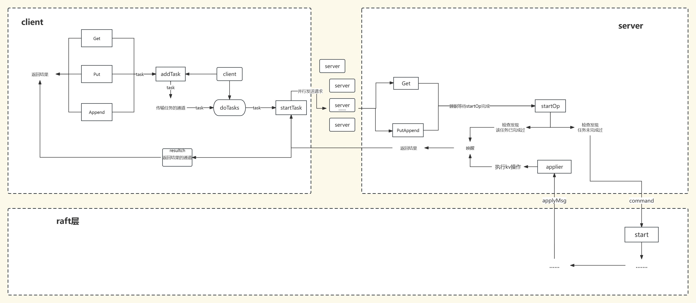

# MIT6.824-lab3

这是MIT6.824分布式系统lab3实验记录，该实验在课程组所给出的框架下，基于lab2的raft实现了一个基础的键值对存储服务

##  整体架构

## 实现细节

**client端**

* 在client端实现任务超时机制，简化server端的设计
* 在client端每次发送请求时都是并行发送，提高请求任务效率
* 使用通道进行线程间Task的传输，并在每个Task结构体中包含了一个返回结果的resultCh通道，方便返回对应的正确结果给Task

**server端**

* 在server端使用clientLastTaskIndex保存了每个client已经完成的最后一个任务的下标，用以判断某个client发来的任务是否已经完成过，若已完成，则返回历史结果
* 使用Get、PutAppend函数接收任务，并使用cond条件变量睡眠等待任务下发给raft层完成复制后apply给server，在applier中执行被raft层commit并apply的命令后，唤醒先前睡眠的线程并返回结果
